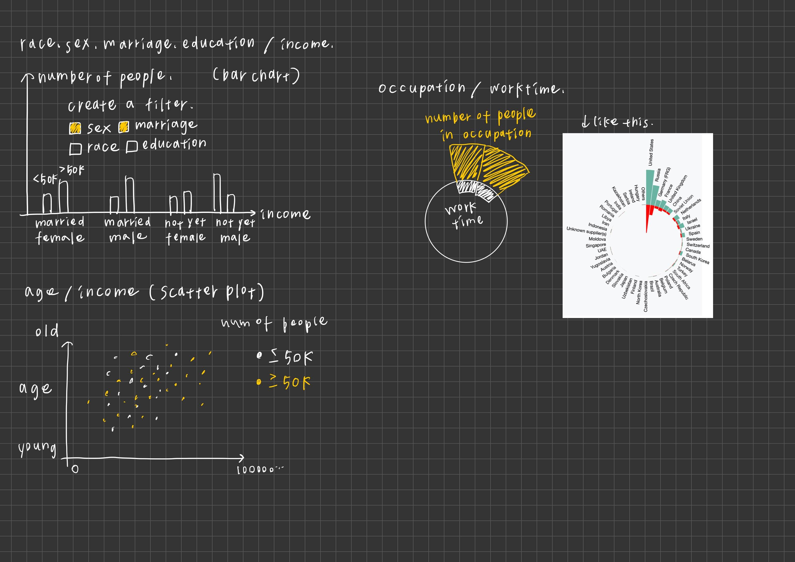

Socioeconomic Determinants of Individual Income
===

## Team Members
41147050S 朱冠宇
41247057S 陳育渝

## Overview
Income is a mater that affects everyone's daily life to life span goal, and every effort we have strived since little is to achieve better income.

There might be numerous factors building on a man's income, which is age, gender, education level, worktime and so on. But it is hard to determine which one is the most important among others.

Therefore, our application will combine those factors and use different charts to display the relationship behind it.
By intersecting them, we will have a better view of the elements of income.

## Dataset

[American Citizens Annual Income](https://www.kaggle.com/datasets/amirhosseinmirzaie/americancitizenincome/data)

The dataset is from kaggle. The columns including many factors like race, gender, education level and the finally: the income of the person is greater than 50K or not?

Eventhough there are many factor columns of it, some factor we may not consider it due to uncomprehend. The column we will use is follwoing:
- sex
> Biological sex of an individual.
- relationship
> Relationship of this individual with others, for example, spouse (Husband). Each data point has only one relationship.
- race
- education.num
> Highest level of education achieved by an individual in numerical form.
- age
- occupation
> General type of occupation of an individual.
- worktime
> Number of hours the individual reported working per week.
- income
> Income, less than or equal to $50,000 (<=50K) or more than that (>50K).

And luckily, the samples in the dataset are all valid, so we won't have to deal with missing values.

## Usage Scenario 
Our potential user varies. For example: a student who is about to graduate from high school, and he wants to find out which factor matters the most to maxiumize his income; or a middle-aged office worker who is exhausted from work, so she wants to find a new job while required less worktime but equal amount of wage; last but not least, a politician who is fight for minority groups right in worktime and payment may use this as a reference.

## Chart Design

## Schedule

We want to start the project after we discuss it with professor.

| Milestones | 朱冠宇 | 陳育渝 |
| :--: | :--: | :--: |
| First Week (12/5 ~ 12/12) | Finish Basic Chart Plots | Finish Basic Chart Plots |
| Second Week (12/12 ~ 12/19) | Build the interactions of three charts | Add some tooltip or brushes, animations |
